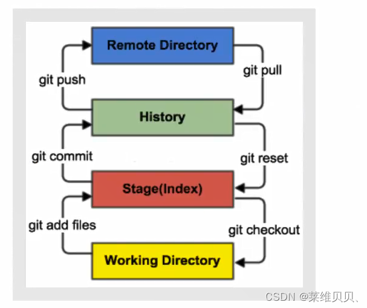
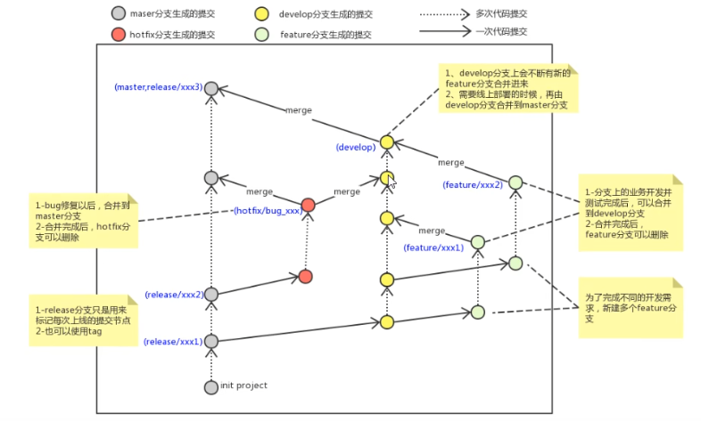

# 1.Git

## 1.1 git配置

配置姓名和邮箱：

```
git config --global user.name "xxx"
git config --global user.email "xxx"
```

## 1.2 git基础指令

> 工作区（新建或修改的文件）
>
> ->add->
>
> 暂存区（授权给git管理但还未上传）
>
> ->commit->
>
> 本地仓库



**创建某文件的本地仓库**

```
git init //生成git文件夹
```

**查看状态**

```
git status
```

**添加至暂存区**

- `git add .`  ：添加目录下全部文件
- `git add 1.txt`  : 添加某文件

**提交至仓库**

```
git commit -m "备注"
```

**查看本地仓库中的文件**

```
git ls-files
```

**查看日志**

- `git log` : 全部日志
- `git log +语句+语句···`：按下列语句条件查看：
  - `--all` ： 显示所有分支
  - `--pretty=online` ： 显示为1行
  - `--abbrev-commit` ： 输出更短的commitId
  - `--graph` ： 以图的形式显示
- `git reflog` ：全部逻辑日志

**版本回退**

```
git reset --hard 某commitId
```

> 选中即复制，按下滚轮即粘贴

**创建忽略列表**

1. 创建gitignore.txt文件1.3

## 1.3 git分支

**查看分支**

```
git branch
git branch -vv  //查看本地分支与远程分支关系
```

> HEAD->分支名  //显示当前所在分支

**创建新分支**

```
git branch 分支名
```

**切换分支**

```
git checkout 分支名
git checkout -b 分支名 //创建并切换到分支
```

**合并分支**

```
git merge  分支名a //把分支名a合并到当前分支
```

**删除分支**

```
git branch -d  分支名 //检查后删除
git branch -D 分支名  //直接删
```

> 不能删除当前分支，想删当前分支先切换

**解决冲突**

> 两个不同分支同一位置数据矛盾时，先进改成目标内容，再add，commit等

**开发中的分支**
master：正式服   hotflix：线上bug修复    develop：体验服，测试后合并到正式服  feature：私服，自己先开发


## 1.4 远程仓库

**创建远程仓库**

[ github仓库建立及配置教程新手教程_FangYwang的博客-CSDN博客](https://blog.csdn.net/qq_44722674/article/details/117200397)

**查看远程仓库**

```
git remote
```

**推送到远程仓库**

法一：

> 直接克隆，把文件拉进去并在克隆文件夹内操作（add，commit，push），见下

法二：

1. 建立连接：`git remote add 远端名（默认为origin） 仓库ssh`
2. 推送：`git push -u(第一次加上) origin 远端分支`

   2.1 可能出现问题的解决：[关于git的问题：error: src refspec main does not match any_TripleGold](https://blog.csdn.net/gongdamrgao/article/details/115032436)

   2.2 -u的含义；其中 `--set-upstream origin 远端分支`表示推送至远端同时关联远端分支

   ```
      git push -u origin master
      等同于
      git push origin master //将当前分支提交到远程origin的master分支
      加上
      git branch --set-upstream-to=origin/master master//将远程仓库origin的master分支与本地仓库master分支关联
   ```

**从远程仓库到本地**

1. 克隆：`git clone 仓库ssh //下载整个文件夹到本地`
2. 抓取：把远程仓库的更新抓到本地，但不会合并分支

   ```
   git fetch 远端名 分支名 //不指定远端名和分支名则抓取全部分支
   ```
   拉取：把远程仓库的更新抓到本地，合并分支（fetch+merge）

   ```
   git pull 远端名 分支名 //不指定远端名和分支名则拉取全部分支
   ```
