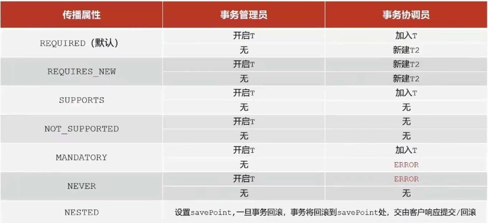
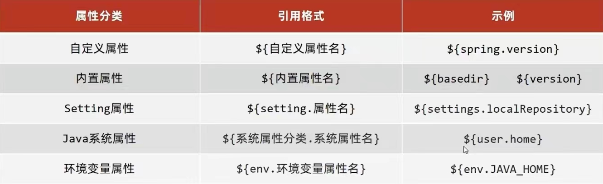

# 1. Spring 基础

## 1.1 核心概念

> * 提供了IOC容器，充当外部
> * 在IOC中创建或管理的对象称为Bean

DI：依赖注入

> 按照本来的关系在容器中建立bean之间的依赖关系

AOP：不改原有的基础上增强功能

> 通知类与通知方法：程序中的共性功能抽取出来单列
>
> 连接点：程序执行的任意位置，在SpringAop中为方法的执行
>
> 切入点：匹配连接点的式子，在SpringAop中为通知方法加入的方法
>
> 切面：连接切入点和通知

# 1.2 基础练习

### 1.2.1 IoC基础练习

1. pom.xml中导入spring坐标

```java
 <dependency>
        <groupId>org.springframework</groupId>
        <artifactId>spring-context</artifactId>
        <version>5.2.10.RELEASE</version>
 </dependency>
```

2. 定义spring管理的类与接口
3. resources中创建spring配置文件，使用bean标签配置bean相关信息

   ```java
   <bean id="IoCData" class="data.IoCDataImpl"/> //id为某一不重复id，class为实现类名
   ```
4. 初始化IOC容器，通过容器获取bean

   ```java
    ApplicationContext ctx=new ClassPathXmlApplicationContext("appContext.xml");//获取IOC容器
    IoCData ioCData= (IoCData) ctx.getBean("IoCData");//获取Bean方式1：按名称
    IoCData ioCData= ctx.getBean("IoCData",IoCData.class);//获取Bean方式2 ：按名称并指定类型
    IoCData ioCData= ctx.getBean(IoCData.class);//获取Bean方式3：按类型，但要保证同类型的bean唯一
    ioCData.display();//使用Bean调用容器内方法
   ```
5. 删除业务层中new出来的对象（为了解耦）
6. 提供对应的set方法（后续由容器内部调用）

   ```java
   public void setIoCData(IoCData ioCData) 
        this.ioCData = ioCData;
   ```
7. 使用property配置bean中对象的关系

   ```java
   <property name="ioCData" ref="IoCData"/>//配置在需要注入的bean标签中，name表示配置的属性，如private IoCData ioCData中的对象ioCData;ref表示参照/连接哪个bean id，即name中对象所在的类IoCData
   ```

### 1.2.2 spring整合mybatis基础练习

1. pom中导入坐标，略
2. 分别设计数据库连接池等两个配置类来替代mybatis中的xml配置文件

   ```java
   public class jdbcConfig {
    @Value("com.mysql.jdbc.Driver")
    private String driver;
    @Value("jdbc:mysql:///test?useSSL=false")
    private String url;
    @Value("root")
    private String username;
    @Value("1234")
    private String password;
    @Bean
    public DataSource dataSource(){
        DruidDataSource druidDataSource=new DruidDataSource();
        druidDataSource.setDriverClassName(driver);
        druidDataSource.setUrl(url);
        druidDataSource.setUsername(username);
        druidDataSource.setPassword(password);
        return druidDataSource;
      }
   }
   ```

   ```java
   public class SpringConfig {
    @Bean
    public SqlSessionFactoryBean sqlSessionFactoryBean(DataSource dataSource){
        SqlSessionFactoryBean sqlSessionFactoryBean=new SqlSessionFactoryBean();
        sqlSessionFactoryBean.setDataSource(dataSource);
        return sqlSessionFactoryBean;
    }
    @Bean
    public MapperScannerConfigurer mapperScannerConfigurer(){
        MapperScannerConfigurer mapperScannerConfigurer=new MapperScannerConfigurer();
        mapperScannerConfigurer.setBasePackage("Data");
        return mapperScannerConfigurer;
    }
   }
   ```

   ```java
   @Configuration
   @ComponentScan({"Data","Service"})
   @PropertySource("classpath:jdbc.properties")
   @Import({jdbcConfig.class,SpringConfig.class})
   public class Config { //这是总的配置类
   }

   ```
3. 服务层代码也要配置为bean和进行自动装配

   ```java
   @Service
   public class UserServiceImpl implements UserService{//这是一个服务层实现类
    @Autowired
    private Mapper mapper;//这是mybatis的查询接口
    public List<User> selectAge(){ //接口中的查询方法
        return mapper.selectAge();
    }
   }
   ```
4. 最后写的main

   ```java
   public class DemoSpring {
    public static void main(String[] args) {
        ApplicationContext applicationContext=new AnnotationConfigApplicationContext(Config.class);
        UserService userService=applicationContext.getBean(UserService.class);
        List<User>user=userService.selectAge();
        System.out.println(user);
    }
   }
   ```

### 1.2.3 AOP基础练习

1. 导坐标
   ```java
   <dependency>
            <groupId>org.aspectj</groupId>
            <artifactId>aspectjweaver</artifactId>
            <version>1.9.5</version>
   </dependency>
   ```
2. 定义接口和实现类
   ```java
   @Repository
   public class AopImpl implements Aop{//实现类
    @Override
    public void save(){ 
        System.out.println(System.currentTimeMillis());
        System.out.println("save");
    }
    @Override
    public void update(){
        System.out.println("update");
    }
   }
   ```
3. 定义通知类，切入点并绑定
   ```java
   @Component
   @Aspect  //告诉spring按aop处理
   public class Notice { //通知类
      //切入点注解
    @Pointcut("execution(void aopdata.Aop.update())") 
    private void cutin(){} 

    @Before("cutin()") //通知类型，绑定连接点与通知
    public void commonMethod(){ //通知方法
        System.out.println(System.currentTimeMillis());
    }
   }
   ```
4. 更改配置类
   ```java
   @Configuration
   @ComponentScan({"aopdata","common"})//别忘了扫包
   @EnableAspectJAutoProxy //告诉spring有用注解开发的aop，系统会寻找@Aspect
   public class Config {
   }
   ```

## 1.3 Bean

### 1.3.1 Bean基础配置

> id: 见1.2.3
>
> class: 见1.2.3
>
> name：是某个bean id的别名，作用等同于cpp里的引用，可以定义多个
>
> scope： 定义bean作用范围。singleton（默认）：单例；即创建出来的对象都是同一个   prototype：非单例

### 1.3.2 Bean实例化

1. **调用实现类的无参构造方法**（哪怕是private）

   ```java
   public class IoCDataImpl implements IoCData{ //一个实现类的例子
   //    public IoCDataImpl() { 除非用有参构造方法覆盖，否则写不写都没事
   //    }
       @Override
       public void display() {
           System.out.println("data");
       }
   }
   ```

   ```java
   <bean id="hello" class="IoCDataImpl"/> //class为实现类
   ```
2. 静态工厂实例化

   ```java
   public class Factory{ //一个静态工厂的例子，返回实现类对象
      puublic static IoCData getIoCData(){
         return new IoCDataImpl();
      }
   }

   IoCData iocData= Factory.getIoCData();//main函数中的调用方式

   ```

   ```java
   <bean id="hello" class="Factory" factory-method="getIoCData"/> //class为工厂类名，factory-method为工厂里造对象的方法
   ```
3. 实例工厂实例化

   ```java
   public class Factory{ //一个实例工厂类的例子
      public IoCData getIoCData(){
         return new IoCDataImpl();
      }
   }

   Factory factory=new Factory(); //main函数中的调用方式,先创建实例工厂对象，再通过实例工厂对象来创建对象
   IoCData iocData= factory.getIoCData(); 
   ```

   ```java
   <bean id="实例工厂的bean" class="Factory" /> //先造实例工厂的bean
   <bean id="hello" factory-bean="实例工厂的bean" factory-method="getIoCData"/> //factory-bean为实例工厂的bean
   ```
4. **实例工厂实例化的spring优化版**

   ```java
   public class FactoryBean implements FactoryBean<IoCData>{ //一个改良版实例工厂类的例子,接口名为FactoryBean
      public IoCData getObject() throws Exception{ //代替3中工厂中创建对象的方法
         return new IoCDataImpl();
      }
      public Class<?> getObjectType(){ //获取对象类型的方法
         return IoCData.class;
      }
      public boolean isSingleton(){
         return true;//false则为非单例
      }
   }
   ```

   ```java
   <bean id="hello" class="FactoryBean" /> //class为改良版工厂类，配置比3简单多了
   ```

### 1.3.3 Bean的生命周期

1. bean初始化

   ```java
   public class IoCDataImpl implements IoCData{
   public void init(){ //在实现类中定义一个初始化方法
           System.out.println(1);
   	}
   }
   ```

   ```java
    <bean id="IoCData"  init-method="init"/> //配置时注明初始方法即可
   ```
2. bean销毁

   ```java
    <bean id="IoCData"  destory-method="destory"/> //如上述设置后，不会实现实现类中destory方法，因为虚拟机关闭时没有给bean销毁的机会，手动销毁如下：
   ```

   2.1 暴力法：直接手动关闭容器

   ```java
   ClassPathXmlApplicationContext ctx=new ClassPathXmlApplicationContext("appContext.xml");//其中ClassPathXmlApplicationContext是ApplicationContext接口的实现类
   ctx.close(); //后面的有关ctx的全部执行不了
   ```

   2.2 设置关闭钩子：告诉虚拟机做完所有事情之后关的时候先把容器关了

   ```java
   ClassPathXmlApplicationContext ctx=new ClassPathXmlApplicationContext("appContext.xml");
   ctx.registerShutdownHook();//只是告诉虚拟机有这回事，执行完记得关好吧
   ```
3. **初始化与销毁之spring优化版**：不需要配置bean的属性

   ```java
   public class IoCServiceImpl implements IoCService , InitializingBean, DisposableBean { //一个实现类的例子，调用了InitializingBean, DisposableBean两个接口

    private IoCServiceImpl() {
        System.out.println("nihao");
    }

    private IoCData ioCData;
    public void display(){
        System.out.println("service");
        ioCData.display();
    }

    public void setIoCData(IoCData ioCData) {
        this.ioCData = ioCData;
    }

    @Override
    public void destroy() throws Exception { //重写接口中销毁方法

    }

    @Override
    public void afterPropertiesSet() throws Exception { //重写接口中初始化方法，但是在setIoCData（对象属性注入）之后执行

    }
   }
   ```
4. bean生命周期

   创建对象 》执行构造方法 》执行set（属性设置）》执行初始化方法 》使用bean干活 》执行销毁方法

### 1.3.4 依赖注入

1. setter引用注入：见1.2.6-7
2. setter简单类型诸如：

   ```java
   private int data; //在某一实现类中，不是像上面注入引用对象private IoCData ioCData;，而是注入简单类型
   public void setData(int data) {  //并生成对应的注入方法
        this.data = data;
    }
   ```

   ```java
   <property name="data" value="10"/> //value表示简单类型的值
   ```
3. 构造器注入

   ```java
   private IoCData ioCData;
   public IoCServiceImpl(IoCData ioCData) { //换了个方法形式而已，里面都一样
        this.ioCData = ioCData;
   }
   ```

   ```java
   <constructor-arg name="ioCData" ref="IoCData"/> //与property同样的位置，不过name表示构造器中形参的名称，不是对象的名称。后面的ref还是value同上

   ```
4. **自动装配**

   > 保留setter方法，更改bean配置，删除property等具体配置
   > 不能操作对简单类型
   > 优先级低于1-3
   >

   ```java
   <bean ··· autowire="byType"/> //byType按类型注入：按注入对象的类名去匹配，提供要求保证注入对象的类型存在唯一的bean
   <bean ··· autowire="byName"/> //byName:按名称注入：按set方法名去匹配（如有setData就去匹配data）要求保证存在一个id与注入对象相同的bean
   ```
5. 集合注入

   ```java
   <property name="arrayA">//集合变量的名字
      <array> //集合的类型
         <value>100</value> //可以写很多行这个。单值格式，如array，list等
         <entry key="1" value="100"/> //键值对格式，如map
         <prop key="country">china</prop> //properties格式，值写中间
      </array>
   </property>
   ```
6. 第三方资源配置

   1. pom中导入坐标
   2. 查看管理对象中的构造方法和setter方法是否符合注入要求并选择合适的注入方式
   3. 加载外部properties文件

      1. 开启context命名空间：复制至更改处并将beans改为context（原来的也别删）

      ```java
      <beans xmlns="http://www.springframework.org/schema/beans"
       xmlns:xsi="http://www.w3.org/2001/XMLSchema-instance"
       xmlns:context="http://www.springframework.org/schema/context" //更改1
       xsi:schemaLocation="http://www.springframework.org/schema/beans  
                           http://www.springframework.org/schema/beans/spring-beans.xsd
                           http://www.springframework.org/schema/context  //更改2
                           http://www.springframework.org/schema/context/spring-context.xsd //更改3
      ">
      ```

      2. 使用context空间加载properties文件

      ```java
      <context:property-placeholder location="classpath*:*.properties" system-properties-mode="NEVER"/> 
      //classpath*:表示可以从当前工程及其依赖的jar包中读取(不想从依赖的jar包读取去掉*)  
      //*.properties表示所有的properties文件
      //最后一个属性防止配置的属性（如jdbc.username）与系统的冲突，可不加
      ```

      3. 使用属性占位符${}读取属性

      ```java
      <properties name="username" value="root"> //例：原格式
      jdbc.username=root;  //properties文件中属性
      <properties name="username" value="${jdbc.username}"> //更改后的格式
      ```

## 1.4 注解

### 1.4.1 配置Bean（替代功能1.2.3）

1. 加入注解
   ```java
   @Component("ioCData") //替代bean id。使用1.2.4中方式3获取时因为是按类型获取则不用加括号
   public class IoCDataImpl implements IoCData{ 
      ···· //这是一个实现类
   }
   ```
2. 开启context命名空间,见上
3. 配置标签
   ```java
   <context:component-scan base-package="包路径"/> //自动扫描包路径下的所有类，替代bean class
   ```

> @Component衍生注解：功能一样，场合不同
>
> * @Controller：表现层bean
> * @Service：业务层bean
> * @Repository：数据层bean

### 1.4.2纯注解开发（替代功能1.4.1中2-3）

1. 配置：

   ```java
      @Configuration//定义配置类代替配置文件
      @ComponentScan("包路径") //替代1.4.1中3，定义多个路径用{}格式
      public class SpringConfig{}
   ```
2. 获取IoC容器

   ```java
      //main中代码：
      Application ctx=new AnnotationConfigApplication(SpringConfig.class)//替代1.2.4中的IOC容器获取，括号里的是上面定义的配置类
   ```
3. 管理bean作用范围和生命周期

   ```java
      @Scope("prototype") //替代1.3.1中bean作用范围
      public class IoCDataImpl implements IoCData{ //这是一个实现类
         @PostContruct//替代1.3.3中bean的初始化方法
         public void init(){
            ···
         }
         @PreDistory//替代1.3.3中bean的销毁方法
         public void destory(){
            ···
         }
      }
   ```
4. 依赖注入

   > 引用类型注入
   >

   ```java
      @Service
      public class IoCServiceImpl implements IoCService{ //这是一个实现类
         @Autowired //按类型注入。替代1.3.4.4中的自动装配,且由于其基于反射，故不用提供setter方法
         public IoCData ioCData;

         @Autowired
         @Qulifier("bean id")//当有多个调用相同接口的实现类时，使用按名称注入。名称为实现类前使用注解定义的bean id
         public IoCData ioCData;
      }
   ```

   > 简单类型注入
   >

   ```java
      @Service
      public class IoCServiceImpl implements IoCService{ //这是一个实现类
         @Value(1)
         private int age;
      }
   ```
5. 第三方资源配置：替代1.3.4.6

   ```java
   @Configuration
   @ComponentScan("包路径") 
   @ProperSource("classpath:xxx.properties") //配置文件名,多个的话支持大括号，不支持*
   public class SpringConfig{} //配置类
   ```

   ```java
   @Service
      public class IoCServiceImpl implements IoCService{ 
         @Value(${properties文件中属性})
         private int age;
      }
   ```
6. 管理第三方bean

   ```java
   @Value(properties文件中属性)//简单类型依赖注入
     private int age;
   //第三方bean配置类  
   public class JdbcConfig（Data data）{ //引用类型依赖注入：做为形参
      @Bean
      public Data data(){//定义方法获取要管理的对象
         xxx ds=new xxx();//第三方的获取资源接口
         ds.setAge(age);//第三方setter方法设置属性
         return ds;
      }
   } 
   ```

   ```java
   @Configuration
   @ComponentScan("包路径") 
   @ProperSource("classpath:xxx.properties")
   @Import({JdbcConfig.class})
   public class SpringConfig{//导入spring配置类中
   } 
   ```

## 1.5 AOP

### 1.5.1 AOP工作流程

* spring容器启动
* 读取使用中的切入点（即@Pointcut和在切入方法前使用注解声明的）
* 初始化bean，判定bean对应的类是否匹配到切入点
  1. 匹配失败：创建对象
  2. 匹配成功：创建目标对象的代理对象（但类型是代理类型proxy）
* 1情况下，正常操作。2情况下，运行原始方法与增加的方法

### 1.5.2 AOP切入点表达式

* 描述方式：动作关键字（访问修饰符 返回值 包 . 类或接口 . 方法 异常）

  > 动作关键字：描述切入点行为，如execution：执行
  > 访问修饰符：可省略public
  >

  ```java
   execution(void aopdata.Aop.update()) //描述接口，通常情况下
   execution(void aopdata.AopImpl.update()) //描述实现类
  ```
* 通配符

  * *：任意存在值或模糊匹配
    ```java
    // 1.返回值不限 2.com.tecent包下的任意目录（一个*对应一层） 3.select开头的参数 4.任意参数（但至少有一个）
    execution(public * com.tecent.*.User.select*(*))
    ```
  * ..：任意值
    ```java
    // 1.任意目录下（多少层都行） 2.任意参数（可有可没有）
    execution(public int com..User.selectid(..))
    ```
  * +：匹配子类类型
    ```java
    // 匹配User的子类
    execution(public int com..User+.selectid(..))
    ```

### 1.5.3 AOP通知

1. 通知类型

> 格式：`@通知类型("切入点类")`

* @Before：加在基础方法之前执行
* @After：加在基础方法之后执行
* **@Around：基础方法前后都执行**

  ```java
  @Around("cutin()")
                                 //必须声明对基础方法的调用
   public Object commonMethod(ProceedingJoinPoint proceedingJoinPoint) throws Throwable {
        System.out.println(System.currentTimeMillis());
        Object obj=proceedingJoinPoint.proceed(); //调用基础方法
        System.out.println(System.currentTimeMillis());
        return obj；//基础方法返回值需要return才会显示,若基础方法无返回值，则commonMethod返回值为void
    }
  ```
* @AfterReturing：获取返回值

  ```java
  @AfterReturing(value="cutin()",returning="str") //定义str（同名于函数的形参）获取返回值
  public afterreturning(JoinPoint jp,String str){ 
      ···
  }
  ```
* @AfterThrowing：获取异常

  ```java
  @AfterReturing(value="cutin()",throwing="t") //定义t（同名于函数的形参）获取异常值
  public afterthrowing(JoinPoint jp,Throwable t){ 
      ···
  }
  ```

2. 获取参数

> 格式：见上面函数的形参

* JoinPoint：前，后，返回后，抛出异常后
* ProceedingJoinPoint：环绕

```java
Object[] args=proceedingJoinPoint.getArgs();//获取基础方法的参数
Object[] args=proceedingJoinPoint.getArgs(args);//仅限ProceedingJoinPoint，可在传参进来后更改再放回去
Signature sig=proceedingJoinPoint.getSignature();
String class=sig.getDeclaringTypeName();//基础方法所在位置
String name=sig.getName();//获取基础方法 
```

## 1.6 Spring事务

### 1.6.1 事务流程

1. 业务层接口添加事务管理
   ```java
   @Transactional //在接口添加事务，可以使整个接口同进退
   public interface UserService(){ //这是业务层接口
      @Transactional //也可以在单独对某个方法进行事务管理
      public void select(int a){}
   }
   ```
2. 配置文件中设置业务管理器
   ```java
   @Bean
   public PlatformTransactionManager transactionManager(DataSource dataSource){
      DataSourceTransactionManager ptm=new DataSourceTransactionManager();
      ptm.setDataSource(dataSource);
      return ptm;
   }
   ```
3. 开启注解式事务驱动
   ```java
   @EnableTransactionManagement
   public class Config { //这是配置类
   }
   ```

### 1.6.2 事务角色

> 事务管理员：发起事务方，如业务层中开启事务的方法，将多个协调员与自己整合成一个大事务。例：select(int)
> 事务协调员：加入事务方，如数据层方法或业务层方法。例：getid() getName()

```java
   public class UserService(){ //这是1.6.1中接口的实现类
      @Transactional 
      public void select(int a){ 
         userData.getid(); 
         userData.getName();
      }
   }
```

### 1.6.3 事务配置

> 格式：`@Transactional(属性 = 属性值)`

* readOnly：设置是否为只读事务；true为只读
* timeout：设置事务超时时间；-1为永不超时
* rollbackFor：设置事务回滚所需的异常；默认只回滚error类异常和运行时异常，其他需自己指定。如 `rollbackFor = xxxException.class()`
* rollbackForClassName：同上，如 `rollbackForName = "xxxException"`
* norollbackFor,norollbackForClassName：见上
* propagation：事务协调员对事务管理员事务的处理态度。如 `propagation=Propagation.NEVER`

  

# 2. SpringMVC

> 一种表现层框架开发技术

## 2.1项目练习

1. 导入servlet与springmvc包，配置tomcat
   ```java
   <dependency>
         <groupId>javax.servlet</groupId>
         <artifactId>javax.servlet-api</artifactId>
         <version>3.1.0</version>
         <scope>provided</scope>
   </dependency>
   <dependency>
         <groupId>org.springframework</groupId>
         <artifactId>spring-webmvc</artifactId>
         <version>5.2.10.RELEASE</version>
   </dependency>
   <build>
   <plugins>
    <plugin>
      <groupId>org.apache.tomcat.maven</groupId>
      <artifactId>tomcat7-maven-plugin</artifactId>
      <version>2.1</version>
      <configuration>
        <port>80</port>
        <path>/</path>
      </configuration>
    </plugin>
   </plugins>
   </build>
   ```
2. **创建控制器**
   ```java
   @Controller //springmvc中定义bean注解
   public class UserController {
    @RequestMapping("/save") //设置当前控制器方法请求访问路径，每一个@RequestMapping对应具体的方法
    @ResponseBody //设置控制器返回值为响应体。如将java对象转为json格式的数据，具体是将controller的方法返回的对象通过适当的转换器转换为指定的格式之后，写入到response对象的body区，通常用来返回JSON数据或者是XML数据。
    public String save(){ //处理请求类
        System.out.println("saving");
        return "{'module':'springmvc'}";//模拟返回json数据
    }
   }
   ```
3. 配置类
   ```java
   @Configuration
   @ComponentScan("controller")
   public class springMVCconfig { //配置类
   }
   ```
4. 定义servlet容器启动的配置类，在里面加载spring配置
   ```java
   public class servletConfig extends AbstractDispatcherServletInitializer {
    @Override
    protected WebApplicationContext createServletApplicationContext() { //加载springmvc容器配置
        AnnotationConfigWebApplicationContext applicationContext=new AnnotationConfigWebApplicationContext();
        applicationContext.register(springMVCconfig.class); //注册springmvc配置
        return applicationContext;
    }

    @Override
    protected String[] getServletMappings() { //设置哪些请求给springmvc处理
        return new String[]{"/"}; //所有请求都规springmvc处理
    }

    @Override
    protected WebApplicationContext createRootApplicationContext() { //加载spring容器配置
        return null;
      }
   }

   //上述代码的简化版
   public class servletConfig extends AbstractAnnotationConfigDispatcherServletInitializer{
    @Override
    protected Class<?>[] getRootConfigClasses() { //配spring
        return new Class[0];
    }
    @Override
    protected Class<?>[] getServletConfigClasses() { //配springmvc
        return new Class[]{springMVCconfig.class};
    }
    @Override
    protected String[] getServletMappings() {
        return new String[]{"/"};
    }

    @Override
    protected Filter[] getServletFilters(){ //设置过滤器，处理post请求中的中文乱码
        CharacterEncodingFilter filter=new CharacterEncodingFilter();
        filter.setEncoding("UTF-8");
        return new Filter[]{filter};
    }
   }
   ```
5. 执行流程
   1. 服务器启动，执行servletConfig类，初始化web容器
   2. 执行createServletApplicationContext，在web容器中的servletContext中创建WebApplicationContext对象
   3. 加载springmvc配置，见4中register方法
   4. 进到配置类springMVCconfig中，执行@ComponentScan，进到带有 @Controller的UserController中，在WebApplicationContext对象中加载了bean：UserController
   5. 执行getServletMappings，定义请求通过springmvc
   6. 发送请求localhost/save
   7. web容器发现5中设定，将请求交给springmvc
   8. springmvc通过UserController的@RequestMapping，解析/save，匹配到了save方法并执行

      8+：假设有两个controller，userController,bookController都有save方法怎么办？

      ```java
      @Controller 
      @RequestMapping("/user") //给两个类分别设定映射路径前缀，访问时加上路径访问。如localhost/user/save 
      public class UserController {
      @RequestMapping("/save") 
      @ResponseBody 
      public String save(){···}
      }
      ```

      8++：怎么设置不给springmvc处理请求

      ```java
      @Configuration
      public class springmvcsupport extends WebConfigurationSupport{
         @Override
         protected void addResourceHandlers(ResourceHandlerRegistry registry){
            registry.addResourceHandler("/pages/**").addResourceLocations("/page/"); //如果遇到pages目录下的东西就去访问/page/
         }
      }
      //在总的配置类中记得扫描此类
      ```
   9. 检测到@ResponseBody，将返回值做为响应体返回给请求方

## 2.2 bean加载

> 如何避免spring加载到springmvc的bean

1. 精确扫描，在springconfig配置类的@ComponentScan中定义只扫描spring的bean
2. 过滤掉springmvc的包
   ```java
   @Configuration
   //excludeFilters为过滤器类型，type为过滤类型，后面为过滤类型需要的具体参数
   @ComponentScan(value="大包名",excludeFilters=@ComponentScan.Filter(type=Filtertype.ANNOTATION,classes=Controller.class))
   public class springconfig { //spring的配置类
   }
   ```
3. 服务器启动时加载spring配置
   ```java
     @Override
    protected Class<?>[] getRootConfigClasses() {
        return new Class[]{springconfig.class};
    }
   ```

## 2.3 请求（从服务区获取）

### 2.3.1 发送普通参数

> get请求在params中写，post请求在body的form-urlencoded中写，json在get的body中选择raw，JSON

```java
@Controller 
public class UserController {
    @RequestMapping("/save") 
    @ResponseBody 
    public String save(String name){ //括号里写接收的参数即可
        System.out.println(name);
        return "{'module':'springmvc'}";
    }
}
```

### 2.3.2 不同参数传递

> 设发送的请求中有name和age两个属性

* 不同名称的映射
  ```java
  public String save(@RequestParam("name")String username){···} //@RequestParam把请求中的name和形参的username相对应，一个方法体中可使用多个
  ```
* pojo参数
  ```java
  public String save(User user){···} //假设传入的user对象中有name和age属性，系统会自行对应赋值
  //假设传入的user对象中还有非简单类型的值，如在User类中定义address对象，其中包含city和province两个属性，则发送请求时还需发送address.city address.age两个参数
  private Address address
  ```
* 数组参数
  ```java
  public String save(String[] like){···} //把请求中属性为like的全接到一起
  ```
* 集合参数
  ```java
  public String save(@RequestParam List<String>like){···} //把请求中属性为like的全接到一起,注意要加入注解，否则系统像pojo参数一样，以为like是list的属性
  ```
* json参数
  ```java
   <dependency> //先导坐标
      <groupId>com.fasterxml.jackson.core</groupId>
      <artifactId>jackson-databind</artifactId>
      <version>2.9.0</version>
   </dependency>

   @Configuration
   @ComponentScan("controller")
   @EnableWebMvc //配置类中开启类型转换器convert，可转换如json数据转换成对象的功能
   public class springMVCconfig { //配置类
   }

   public String save(@RequestBody List<String>like){···} //信息是在请求体里，改注解@RequestBody,一个方法体中只能使用一次
   public String save(@RequestBody User user){···} //json发送{"name":"xxx","age":11,"address":{"city":"HK"}}格式的数据
   public String save(@RequestBody List<User>like){···} //json发送[{"name":"xxx","age":11},{"name":"yyy","age":6}]格式的数据
  ```
* 日期参数
  ```java
  public String save(Date date){···} //发送2020/2/2，系统可以将string直接转为date
  public String save(@DateTimeFormat(pattern="yyyy-MM-dd HH:mm:ss") Date date){···} //发送2020-2-2 8:08:08，使用注解自定义格式
  ```

## 2.4 响应（告诉服务器收到了）

* 响应/跳转页面

  ```java
      //注意，没有 @ResponseBody了
      public String save(){return xxx.jsp;}
  ```
* 响应文本

  ```java
    @ResponseBody
      public String save(){return "hello"}
  ```
* 响应pojo

  ```java
    @ResponseBody
      public User save(){
         User user=new User();
         这里是user的set函数···
         return user;
      }

      @ResponseBody
      public List<User> save(){
         User user=new User();
         List<User>list=new ArrayList<>();
         这里是user的set函数和list的函数···
         return list;
      }
  ```

## 2.5 REST风格

> **一种资源的访问形式**
> 由这种 localhost/user/add 表示保存，localhost/user/delete 表示删除
> 到localhost/users 使用POST请求格式表示保存，PUT格式表示删除

* GET：从服务器取出资源（一项或多项）
* POST：在服务器新建一个资源
* PUT：在服务器更新资源（更新完整资源）
* PATCH：在服务器更新资源（更新个别属性）
* DELETE：从服务器删除资源

```java
   @RestController // @ResponseBody+@Contoller
   @RequestMapping("/users")
   public class UserController {
    @PostMapping  //@RequestMapping(method=RequestMethod.POST)的简化版
    public String save(){  //无参的
        return "{'module':'springmvc'}";
      }

    @GetMapping("/{id}") //@RequestMapping(value="/{id}",method=RequestMethod.GET)的简化版,需要包含形参,代表value后面路径包含参数的含义
    public String get(@PathVariable Integer id){  //有参的，注解@PathVariable代表从value后面的路径取值,参数较少时可以使用其来接收
        return "{'module':'springmvc'}";
      }
   }
```

## 2.6 SSM整合

1. 导入坐标

```java
   <dependencies>
    <dependency>
      <groupId>junit</groupId>
      <artifactId>junit</artifactId>
      <version>4.12</version>
      <scope>test</scope>
    </dependency>
    <dependency>
      <groupId>org.springframework</groupId>
      <artifactId>spring-test</artifactId>
      <version>5.2.10.RELEASE</version>
    </dependency>
    <dependency>
      <groupId>org.springframework</groupId>
      <artifactId>spring-context</artifactId>
      <version>5.2.10.RELEASE</version>
    </dependency>
    <dependency>
      <groupId>org.springframework</groupId>
      <artifactId>spring-webmvc</artifactId>
      <version>5.2.10.RELEASE</version>
    </dependency>
    <dependency>
      <groupId>org.springframework</groupId>
      <artifactId>spring-jdbc</artifactId>
      <version>5.2.10.RELEASE</version>
    </dependency>
    <dependency>
      <groupId>org.mybatis</groupId>
      <artifactId>mybatis-spring</artifactId>
      <version>2.0.0</version>
    </dependency>
    <dependency>
      <groupId>com.alibaba</groupId>
      <artifactId>druid</artifactId>
      <version>1.1.16</version>
    </dependency>
    <dependency>
      <groupId>javax.servlet</groupId>
      <artifactId>javax.servlet-api</artifactId>
      <version>3.1.0</version>
      <scope>provided</scope>
    </dependency>
    <dependency>
      <groupId>com.fasterxml.jackson.core</groupId>
      <artifactId>jackson-databind</artifactId>
      <version>2.9.0</version>
    </dependency>
    <dependency>
      <groupId>mysql</groupId>
      <artifactId>mysql-connector-java</artifactId>
      <version>5.1.46</version>
    </dependency>
    <dependency>
      <groupId>org.mybatis</groupId>
      <artifactId>mybatis</artifactId>
      <version>3.5.5</version>
    </dependency>

  </dependencies>

  <build>
    <plugins>
      <plugin>
        <groupId>org.apache.tomcat.maven</groupId>
        <artifactId>tomcat7-maven-plugin</artifactId>
        <version>2.1</version>
        <configuration>
          <port>80</port>
          <path>/</path>
        </configuration>
      </plugin>
    </plugins>
  </build>
```

2. 数据库对应的数据类

```java
public class User {
    private Integer id;
    private String NAME;
    private Integer age;
public User(Integer id, String NAME, Integer age) {
        this.id = id;
        this.NAME = NAME;
        this.age = age;
}
public Integer getId() {return id;}
public void setId(Integer id) {this.id = id;}
public String getNAME() {return NAME;}
public void setNAME(String NAME) {this.NAME = NAME;}
public Integer getAge() {return age;}
public void setAge(Integer age) {this.age = age;}
@Override
public String toString() {return "User{" +"id=" + id +", NAME='" + NAME + '\'' +", age=" + age +'}';}
   }
```

3. 配置类

```java
@Configuration
@ComponentScan({"controller","config"})
@EnableWebMvc
public class springMVCconfig { //配置springmvc,见2.3.2/900
}

@Configuration
@ComponentScan({"controller","userData","userService"})
@PropertySource("classpath:jdbc.properties")
@Import({jdbcConfig.class,mybatisConfig.class})
@EnableTransactionManagement //开启事务接口
public class SpringConfig { //配置spring,见1.2.2.2/110
}

public class jdbcConfig { //配置jdbc配置类，见
    @Value("${jdbc.driver}") //使用1.4.2.5的依赖注入
    private String driver;
    @Value("${jdbc.url}")
    private String url;
    @Value("${jdbc.username}")
    private String username;
    @Value("${jdbc.password}")
    private String password;
    @Bean
    public DataSource dataSource(){
        DruidDataSource druidDataSource=new DruidDataSource();
        druidDataSource.setDriverClassName(driver);
        druidDataSource.setUrl(url);
        druidDataSource.setUsername(username);
        druidDataSource.setPassword(password);
        return druidDataSource;
    }
    @Bean
    public PlatformTransactionManager transactionManager(DataSource dataSource){ //事务管理器
        DataSourceTransactionManager dataSourceTransactionManager=new DataSourceTransactionManager();
        dataSourceTransactionManager.setDataSource(dataSource);
        return dataSourceTransactionManager;
    }
}

public class mybatisConfig { //mybatis配置类，见1.2.2.2/95
    @Bean
    public SqlSessionFactoryBean sqlSessionFactoryBean(DataSource dataSource){
        SqlSessionFactoryBean sqlSessionFactoryBean=new SqlSessionFactoryBean();
        sqlSessionFactoryBean.setDataSource(dataSource);
        sqlSessionFactoryBean.setTypeAliasesPackage("user");
        return sqlSessionFactoryBean;
    }
    @Bean
    public MapperScannerConfigurer mapperScannerConfigurer(){
        MapperScannerConfigurer mapperScannerConfigurer=new MapperScannerConfigurer();
        mapperScannerConfigurer.setBasePackage("userData");
        return mapperScannerConfigurer;
    }
}
```

4. 配置web容器配置类，见2.1.4/750

```java
public class servletConfig extends AbstractAnnotationConfigDispatcherServletInitializer {
    @Override
    protected Class<?>[] getRootConfigClasses() { //配spring
        return new Class[]{SpringConfig.class};
    }
    @Override
    protected Class<?>[] getServletConfigClasses() { //配springmvc
        return new Class[]{springMVCconfig.class};
    }
    @Override
    protected String[] getServletMappings() {
        return new String[]{"/"};
    }

}
```

5. 阻止springmvc访问拦截前端页面

```java
@Configuration
public class springmvcSupport extends WebMvcConfigurationSupport {//2.1.5.8/822
    @Override
    protected void addResourceHandlers(ResourceHandlerRegistry registry){
        registry.addResourceHandler("/pages/**").addResourceLocations("/page/"); //如果遇到pages目录下的东西就去访问/page/
        registry.addResourceHandler("/css/**").addResourceLocations("/css/");
        registry.addResourceHandler("/js/**").addResourceLocations("/js/");
        registry.addResourceHandler("/plugins/**").addResourceLocations("/plugins/");
    }
}
```

6. 使用restul风格开发表现层bean：controller，见2.3-2.5

```java
@RestController
@RequestMapping("/users")
public class userController {
    @Autowired
    private UserService userService;
  @PostMapping
    public Result save(@RequestBody User user) {
        boolean flag=userService.save(user);
        return new Result(flag,flag?Code.SAVE_OK:Code.SAVE_ERR);
    }
 @DeleteMapping("/{id}")
    public Result delete(@PathVariable Integer id) {
     boolean flag=userService.delete(id);
     return new Result(flag,flag?Code.DELETE_OK:Code.DELETE_ERR);
    }
  @PutMapping
    public Result update(@RequestBody User user) {
      boolean flag=userService.update(user);
      return new Result(flag,flag?Code.UPDATE_OK:Code.UPDATE_ERR);
    }
 @GetMapping
    public Result select() {
        List<User>user=userService.select();
        Integer code=user!=null?Code.SELECT_OK:Code.SELECT_ERR;
        String msg=user!=null?"":"select fail";
        return new Result(user,code,msg);
    }
}
```

7. 数据层接口

```java
public interface UserData {
    @Insert("insert into stu values (null,#{NAME},#{age})")
    public int save(User user);
    @Delete("delete from stu where id=#{id}")
    public int delete(Integer id);
    @Update("update stu set NAME= #{NAME},age=#{age}) where id=#{id}}")
    public int update(User user);
    @Select("select *from stu")
    public List<User> select();
}
```

8. 服务层接口和实现类

```java
@Transactional //事务注解，1.6.1/650
public interface UserService {
    /**
     * 保存
     * @param user
     * @return
     */
    public boolean save(User user);
    /**
     * 删除
     * @param id
     * @return
     */
    public boolean delete(Integer id);
    /**
     * 修改
     * @param user
     * @return
     */
    public boolean update(User user);
    /**
     * 查询
     * @return
     */
    public List<User> select();
}

@Service
public class UserServiceImpl implements UserService{
    @Autowired
    private UserData userData;
    @Override
    public boolean save(User user) {
        return userData.save(user)>0;
    }
    @Override
    public boolean delete(Integer id) {
        return userData.delete(id)>0;
    }
    @Override
    public boolean update(User user) {
        return userData.update(user)>0;
    }
    @Override
    public List<User> select() {
        try{ //模拟下异常
            int i=1/0;
        }catch (Exception exception){
            throw new SystemException("shabi",exception,Code.SYSTEM_ERR);
        }
        return userData.select();
    }
}
```

9. 写测试类

```java
@RunWith(SpringJUnit4ClassRunner.class)
@ContextConfiguration(classes = SpringConfig.class)
public class userServiceTest {
    @Autowired
    private UserService userService;
    @Test
    public void test(){
        List<User> user=userService.select();
        System.out.println(user);
    }
}

```

10. 定义前端返回值的包装类

```java
public class Result {
    private Object data;
    private Integer code;
    private String msg;
public Result(Object data, Integer code, String msg) {this.data = data;this.code = code;this.msg = msg;}
public Result(Object data, Integer code) {this.data = data;this.code = code;}
public Object getData() {return data;}
public void setData(Object data) {this.data = data;}
public Integer getCode() {return code;}
public void setCode(Integer code) {this.code = code;}
public String getMsg() {return msg;}
public void setMsg(String msg) { this.msg = msg; }
}

public class Code { //code类
    public static final Integer SAVE_OK=20011;
    public static final Integer DELETE_OK=20021;
    public static final Integer UPDATE_OK=20031;
    public static final Integer SELECT_OK=20041;

    public static final Integer SAVE_ERR=20010;
    public static final Integer DELETE_ERR=20020;
    public static final Integer UPDATE_ERR=20030;
    public static final Integer SELECT_ERR=20040;

    public static final Integer SYSTEM_ERR=50001;
    public static final Integer BUSINESS_ERR=50002;
}

```

11. 异常处理类

```java
@RestControllerAdvice //处理rest风格开发的controller
public class doException {
    @ExceptionHandler(SystemException.class)//拦截某一类的异常
    public Result doSystemException(SystemException exception){
        return new Result(null,exception.getCode());
    }
    @ExceptionHandler(BusinessException.class)
    public Result doBusinessException(BusinessException exception){
        return new Result(null,exception.getCode());
    }
}
```

12. 定义具体的异常类

```java
public class BusinessException extends RuntimeException{ //三个参数，data，code，msg
    private Integer code;
    public BusinessException(String message, Integer code) {
        super(message);
        this.code = code;
    }
    public BusinessException(String message, Throwable cause, Integer code) {
        super(message, cause);
        this.code = code;
    }
    public Integer getCode() {
        return code;
    }
    public void setCode(Integer code) {
        this.code = code;
    }
}
```

## 2.7 拦截器

> 作用：在指定的方法调用前面执行或阻止原始方法的执行
> 作用域：属于springmvc，故只能对springmvc的访问进行处理（而filter属于servlet技术，可以对所有访问进行处理）
> 拦截器链：如果有多个拦截器，运行顺序同配置顺序，停止顺序与前面相反，可以理解为用栈来放置的拦截器

```java
@Component
public class ProjectInterceptor implements HandlerInterceptor { //配置拦截器
    @Override //拦截之前的代码                  //可以取出请求和响应中的数据，见下                对原始方法调用的封装，可以操作原始执行的方法
    public boolean preHandle(HttpServletRequest request, HttpServletResponse response, Object handler) throws Exception {
         String s=request.getHeader("Content-Type");//取出发送的请求中的一种数据
//return false则是拦截原始操作，故不会执行所有的postHandle方法和包含此拦截器及后面拦截器的afterCompletion方法，但会执行配置前面拦截器的afterCompletion方法
        return true;
    }
    @Override //拦截之后的代码                                                                                进行页面跳转的相关数据
    public void postHandle(HttpServletRequest request, HttpServletResponse response, Object handler, ModelAndView modelAndView) throws Exception {
        ···
    }
    @Override //最后执行的代码                                                                                   异常对象
    public void afterCompletion(HttpServletRequest request, HttpServletResponse response, Object handler, Exception ex) throws Exception {
       ···
    }
}

@Configuration
public class springmvcSupport extends WebMvcConfigurationSupport {
    @Autowired
    private ProjectInterceptor projectInterceptor;
    @Override //在2.6.5中加入开启拦截器的路径
    protected void addInterceptors(InterceptorRegistry registry) {
                                 //拦截器对象                         拦截路径
        registry.addInterceptor(projectInterceptor).addPathPatterns("/users");//只能拦截/users，要想拦截users后的全部路径，写/users/*
    }
}
//也可以和springmvc的配置类合并，如：
@Configuration
@ComponentScan({"controller"})
@EnableWebMvc
public class springMVCconfig {
   @Autowired
    private ProjectInterceptor projectInterceptor;
    @Override 
    protected void addInterceptors(InterceptorRegistry registry) {
        registry.addInterceptor(projectInterceptor).addPathPatterns("/users");//只能拦截/users，要想拦截users后的全部路径，写/users/*
    }
}
 
```

# 3. Maven

## 3.1 分模块开发思想

1. 创建一个新的模块，抽离原模块中的类，并放置在相同目录下
2. 新模块通过maven install加载到本地仓库
3. 原模块pom中导入新模块的依赖

```java
<groupId>org.example</groupId>
<artifactId>maven_ssm_user</artifactId>
<version>1.0-SNAPSHOT</version>
```

## 3.2依赖

> 传递性：可以使用依赖中的依赖
> 冲突：选择层级越浅，相同层时配置顺序越靠前，相同文件中配置顺序越靠后的
> 可选依赖（不想让别人知道，失去传递性）：依赖a中打开：`<optional>true</optional>`；自己的b中这还会显示依赖a，但别人依赖b时不会显示a
> 排除依赖（不想用别人的）：依赖b中设置 `<exclusions><exclusion>依赖a的groupip和artifact</exclusion></exclusions>`；把别人依赖b中的依赖a踢走

## 3.3 聚合

> 多个模块组成整个，统一（按依赖关系顺序）构建和管理

```java
<packaging>pom</packaging>  //聚合模块中只有一个pom文件
<modules>
   <module>../xxxxx</module> //聚合的模块
<modules>
```

## 3.4 继承

> 继承父工程的配置信息

```java
<parent> //在子工程中描述
   父工程的坐标
   <relativePath>../父工程的路径</relativePath>
</parent>

<dependencyManagement> //在父工程中描述，子工程中加入不带版本的依赖
   <dependencies>
      可选的依赖
   </dependencies>
</dependencyManagement>
```

## 3.5 属性

> 定义变量来定义统一管理

```java
<properties>//父工程中
   <属性名>属性值</属性名>
</properties>

<标签>${属性名}</标签>//被替代的地方
```

> 资源文件引用pom的属性

```java
<properties>
   <属性名，如jdbc.urlnum>属性值</属性名> //1.定义属性
</properties>

jdbc.url=${jdbc.urlnum} //2.资源文件中使用属性名

<build>
   <resources>
      <resource>
         <directory>${project.basedir}/jdbc文件目录{/directory} //3.父工程资源文件中加载属性过滤器，让2中${}符号可以被解析
         <filtering>true</filtering>
      </resource>
   </resources>
</build>

<plugin> //4.父工程<build>中配置忽略maven打包时的web.xml必须性的检查
   <groupId>org.apache.maven.plugins</groupId>
      <artifactId>maven-war-plugin</artifactId>
      <version>3.2.3</version>
   <configuration>
      <failOnMissingWebXml>false</failOnMissingWebXml>
   </configuration>
</plugin>
```

> maven 系统属性
> 

## 3.6 多环境开发

```java
<profiles>
  <profile> //一个环境一个profile
   <id>某环境的唯一标识</id>
   <properties>
      <jdbc.url>此环境中专用的属性值</jdbc.url>
   <properties/>
   <activation>
        <activeByDefault>true</activeByDefault> //设为默认启动
   </activation>
   </profile>
  </profiles>
```

> maven指令：`mvn install -p 环境id`

## 3.7 跳过测试:三种方法

```java
<plugin>
   <artifactId>maven-surefire-plugin</artifactId>
   <version>2.12.4</version>
   <configuration>
      <skipTests>false</skipTests> //设置是否跳过测试
      <excludes>**/test.java</excludes> //可以指定上面的操作（不）包含具体哪个测试类
   </configuration>
</plugin>
```

2. `mvn install -D skipTests`
3. 闪电按钮

## 3.8 私服

* 启动：bin目录下cmd `nexus.exe /run nexus`
* 访问：localhost:8081
* 仓库：
  >宿主仓库hosted(小组内自己用仓库):自研+外部资源;关联上传操作
  >代理仓库proxy（全部公用的）:代理连接中央仓库;关联下载
  >仓库组group（小组公用仓库组）:简化下载;关联下载
* 上传配置
```java
<distributionManagement>
   <repository>
      <id>wang-release</id>
      <url>http://localhost:8081/repository/wang-release/</url>
   </repository>
   <snapshotRepository>
      <id>wang-snapshot</id>
      <url>http://localhost:8081/repository/wang-snapshot/</url>
   </snapshotRepository>
</distributionManagement>
```
# 4 Springboot
## 4.1 入门案例

>快速启动：对springboot工程package后在文件目录下执行`java -jar 项目名称.jar（首字母+tab键）`（还需要有spring-boot-maven-plugin插件）


         
    
